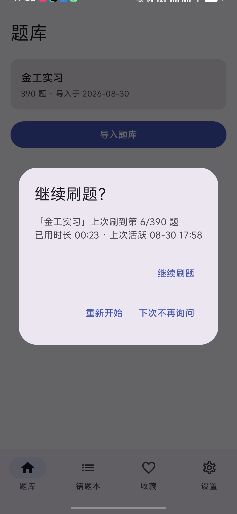
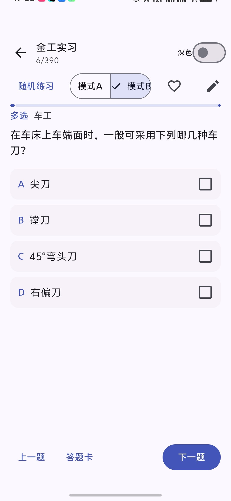
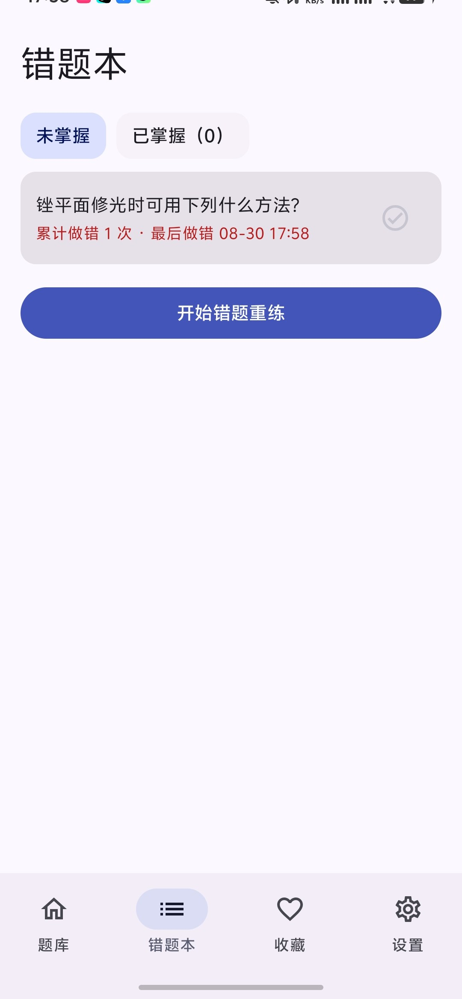

# Reps

> **One more rep.** 把老师下发的题库 CSV，一键变成手机上可反复背诵的离线刷题应用。

原生 Android · Kotlin · Jetpack Compose (Material 3) · Room/SQLite · **完全离线 · 无广告 · MIT 开源**

| 首页 | 刷题 | 错题本 |
|---|---|---|
|  |  |  |

## 下载

从 [GitHub Releases](https://github.com/coderirse/Reps/releases/latest) 下载最新 APK，安装即可（需允许安装未知来源应用）。

## 功能

- **内置题库**：金工实习 390 题（单选 191 / 多选 73 / 判断 126，8 章节，60 题带图），装上即用
- **通用导入**：任意标准 CSV 题库（UTF-8 / GBK 自动识别，导入前预览校验，逐行错误报告）
- **六种练习**：顺序 / 随机 / 专项（章节·分类）/ 自定义组卷（配额 + 题序 + 倒计时）/ 错题重练 / 收藏练习
- **两种背题模式**：模式 A 浏览（答案直接展开）/ 模式 B 检验（选后判分，错题自动归集），随时切换不丢状态
- **进度无忧**：切题即存 + 5 秒静默存 + 退后台兜底；启动恢复弹窗，7 天内进度不丢
- **错题本**：答错自动收录，连对 2 次自动掌握，支持手动标记
- **收藏与笔记**：重点题集中练，随时给题目写笔记
- **夜间模式 / 字体大小 / 数据清除**，设置齐全

## CSV 题库格式

```csv
id,content,type,option_a,option_b,option_c,option_d,option_e,option_f,correct_answer,explanation,category,chapter,image
1,哲学的基本问题是,single,思维与存在,理论与实践,,,,"",A,解析内容,马原,第一章,
```

- `type`：`single`（单选）/ `judge`（判断）/ `multi`（多选，全对才判对）
- `correct_answer`：单选填字母，判断填 `对/错`（`true/false` 亦可），多选如 `A,C`
- 编码支持 UTF-8（含 BOM）与 GBK/GB18030 自动识别
- 通过系统文件选择器导入，导入前可预览校验

## 隐私

App **不申请网络权限**（可在安装信息中核验），所有数据仅存本机，卸载即清除。无账号、无广告、无统计。

## 开发

技术栈与架构见 [docs/DEVELOPMENT.md](docs/DEVELOPMENT.md)，产品需求见 [docs/PRODUCT.md](docs/PRODUCT.md)。

```bash
./gradlew testDebugUnitTest   # 单元测试
./gradlew assembleRelease     # 构建签名包（无 keystore 时自动回退 debug 签名）
```

## 开发进度

- [x] Phase 0 — 调研、产品/开发文档
- [x] Phase 1 — 骨架（数据库、导航、空状态）
- [x] Phase 2 — 题库导入与刷题闭环（含多选题、自定义组卷与定时）
- [x] Phase 3 — 会话恢复、错题本、收藏、笔记、内置金工实习题库（390 题带图）
- [x] Phase 4 — 发布打磨（R8、CI、发布检查）

## License

MIT
